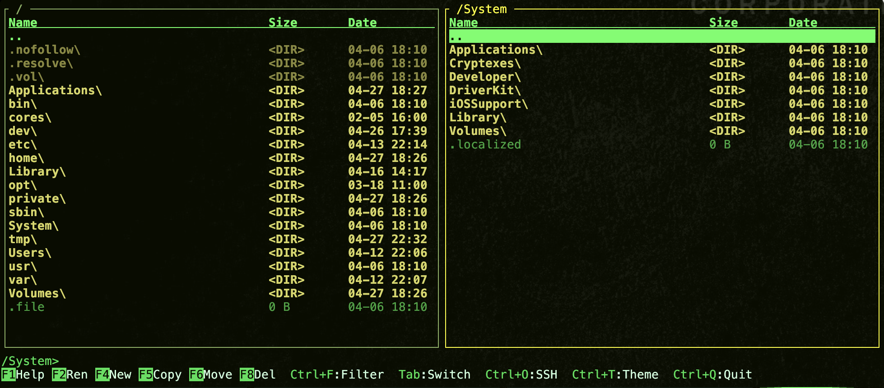

```
 ██████╗ ██████╗ ████████╗
██╔════╝ ██╔══██╗╚══██╔══╝
██║      ██████╔╝   ██║
██║      ██╔═══╝    ██║
╚██████╗ ██║        ██║
 ╚═════╝ ╚═╝        ╚═╝
```

Dual-pane TUI file explorer in the style of Total Commander, written in Rust.
Single native binary, no runtime dependencies.



## Features

- Dual-pane navigation, arrow keys only
- Copy / move / rename / delete with conflict resolution
- Multi-select (Space, Ctrl+A) with size totals
- Quick filter (Ctrl+F) on the active pane
- Bookmarks panel (Ctrl+B), persisted to disk
- 256-color theme editor (Ctrl+T) with live preview
- Embedded text editor (Enter on a file): undo/redo, search, copy/paste
- Archive unpack and pack: `.zip`, `.tar.*`, `.7z`, `.rar`, `.gz`, `.bz2`, `.xz`
- SSH/SFTP remote browsing (`ssh user@host`)
- Async task runner with live output window
- Session restore on launch

## Build

Requires Rust stable (edition 2024) and a 256-color terminal.

```sh
cargo build --release
```

## Usage

```sh
cpt                       # restore last session
cpt /path/to/dir          # set left pane
cpt /left /right          # set both panes
cpt --debug               # write log to cpt.log
```

## Keybindings

| Key | Action |
|-----|--------|
| `F1` | Help |
| `F2` | Rename |
| `F3` | View in `$PAGER` |
| `F4` | New file |
| `F5` | Copy to other pane |
| `F6` | Move to other pane |
| `F7` | New directory |
| `F8` / `Del` | Delete |
| `Tab` | Switch pane |
| `Enter` | Enter dir / open file in editor |
| `Space` / `Insert` | Toggle selection |
| `Ctrl+A` | Select all (toggle) |
| `Ctrl+F` | Quick filter (or search in editor) |
| `Ctrl+B` | Bookmarks panel |
| `Ctrl+T` | Theme editor |
| `Ctrl+O` | SSH connect dialog |
| `Ctrl+Z` | Minimize / restore task window |
| `Ctrl+Q` | Quit |

Type any printable character in normal mode to open an inline command line.
`cd <path>` navigates the active pane; anything else runs through the system shell.

## Configuration

Files are managed by [confy] and stored per platform:

| Platform | Path |
|----------|------|
| Linux | `~/.config/rs.cpt/` |
| macOS | `~/Library/Application Support/rs.cpt/` |
| Windows | `%APPDATA%\rs.cpt\` |

| File | Contents |
|------|----------|
| `cpt.toml` | Last directories, active pane, theme |
| `bookmarks.toml` | Saved bookmarks |
| `themes/<name>.toml` | Custom themes (26 color fields) |
| `cpt.log` | Debug log (only with `--debug`) |

## License

MIT

[confy]: https://crates.io/crates/confy
